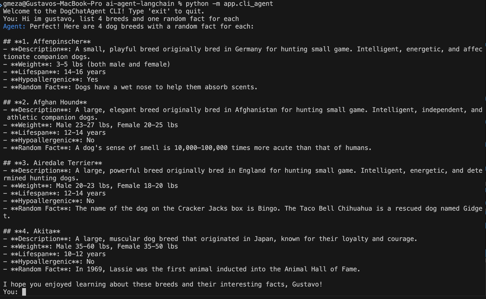
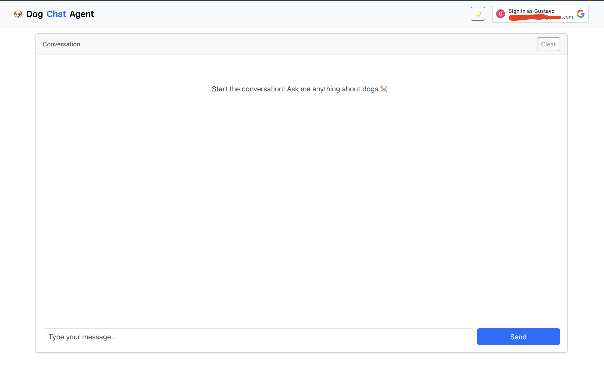
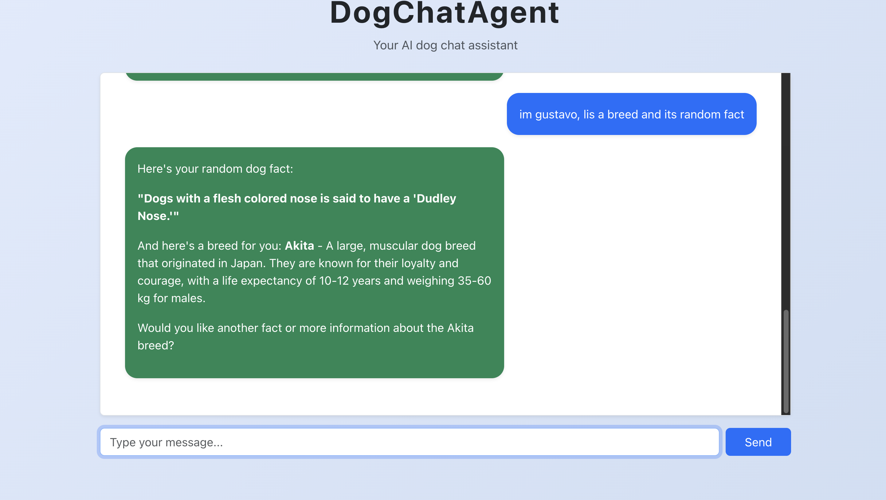

# AI Agents with LangChain


# AI Agent LangChain Project

## Overview
This project is an advanced AI agent system built with LangChain, integrating the DeepSeek LLM and leveraging tool calls for actionable, data-driven responses. The agent is designed to interact with users through both a command-line interface and a modern web chat frontend, and is served as a RESTful Web API using FastAPI.

## Key Features
- **LangChain Integration:** Utilizes LangChain for agent orchestration, memory management, and tool binding.
- **DeepSeek LLM:** The agent uses DeepSeek as its core language model, providing high-quality conversational and reasoning capabilities.
- **Tool Calls:** Instead of relying solely on the LLM, the agent can invoke external tools (e.g., APIs for dog facts, breed info) to fetch real data and perform actions, making responses more useful and interactive.
- **Web API:** The agent is exposed via a FastAPI REST endpoint (`/chat`), supporting multi-turn conversations with thread/session memory.
- **Clients:**
  - **Command Line Client:** Interact with the agent in your terminal, with session memory and clear separation of user/agent messages.
  - **Chat Frontend:** A responsive React web app styled with Bootstrap, providing a modern chat experience and session continuity.

## How It Works
1. **Agent Core:** The agent is built using LangChain's agent and memory modules, with DeepSeek as the LLM. Tools are bound for specific actions (e.g., fetching dog facts).
2. **Web API:** The FastAPI server exposes a `/chat` endpoint. Each request can start a new thread or continue an existing one using a `thread_id`.
3. **Clients:**
	- The CLI client maintains a session and interacts with the agent via the API.
	- The web frontend keeps the `thread_id` in session storage, allowing multi-turn chat with the agent.

## Getting Started
1. **Create a `.env` file in the project root:**
	- Add your DeepSeek API key:
	  ```
	  export DEEPSEEK_API_KEY=<API-KEY>
	  ```
2. **Install dependencies:**
	- Python: `pip install -r requirements.txt`
	- Node.js (for frontend): `cd frontend && npm install`
2. **Run the API server:**
	- `uvicorn controller.api:app --reload`
3. **Run the CLI client:**
	- `python -m cli_agent`
4. **Run the frontend:**
	- `cd frontend && npm run dev`

## Example Use Cases
- Ask for dog facts, breed information, or other data-driven queries.
- Multi-turn conversations with memory (thread/session).
- Integrate new tools for additional capabilities.

## Project Structure
- `app/agent/` — Agent logic and tool integration
- `app/controller/` — FastAPI Web API
- `app/main.py` — Command line client
- `frontend/` — React chat frontend


## Demo

### Command Line Client


### Chat Frontend



## Credits
- Built with [LangChain](https://langchain.com/), [DeepSeek](https://deepseek.com/), [FastAPI](https://fastapi.tiangolo.com/), and [React](https://react.dev/).