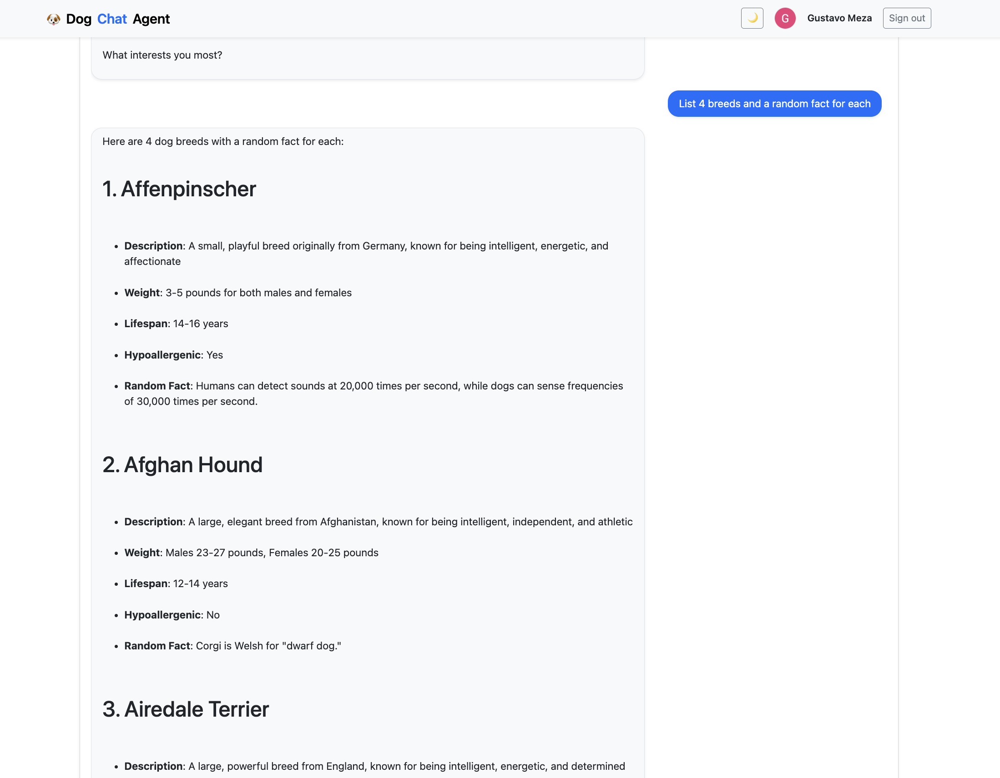

# AI Agents with LangChain


# AI Agent LangChain Project

## Overview
This is a cloud-deployed AI agent system built with LangChain and powered by DeepSeek LLM. The system leverages tool calls for actionable, data-driven responses and features a modern, fully automated cloud architecture with a React frontend hosted on GitHub Pages and a Python Azure Functions backend, all provisioned through Terraform infrastructure as code.

## Key Features
- **LangChain + DeepSeek Engine:** Advanced AI agent architecture where LangChain orchestrates intelligent tool calling and DeepSeek LLM provides superior reasoning capabilities, enabling dynamic decision-making about when to fetch external data vs. using internal knowledge.
- **Cloud-Native Architecture:** Fully deployed on Azure with serverless functions, ensuring scalability and cost efficiency.
- **GitHub Pages Frontend:** Modern React chat interface hosted on GitHub Pages with responsive design and session continuity.
- **Azure Functions Backend:** Serverless Python functions providing RESTful API endpoints with automatic scaling.
- **Infrastructure as Code:** Complete infrastructure automation using Terraform for reproducible deployments.
- **Intelligent Tool Calls:** LangChain agent dynamically selects and executes external tools (dog breed APIs, fact databases) based on user intent, combining LLM reasoning with real-time data retrieval for more accurate and actionable responses.
- **Session Management:** Multi-turn conversations with persistent memory across chat sessions.
- **CLI Development Client:** Local command-line interface for development and testing.

## Architecture
1. **Frontend (GitHub Pages):** React-based chat interface deployed automatically via GitHub Actions to GitHub Pages, providing a responsive web experience with integrated Google OAuth authentication.
2. **Backend (Azure Functions):** Serverless Python functions powered by LangChain agent framework with DeepSeek LLM as the reasoning engine. The backend implements intelligent tool calling capabilities, allowing the AI agent to invoke external APIs (dog facts, breed information) for real-time data retrieval, making responses more actionable than pure LLM generation.
3. **Authentication Layer:** Google OAuth integration providing secure user authentication, with Azure Functions handling token validation and user session management.
4. **Infrastructure (Terraform):** Complete infrastructure provisioning including Azure Functions, Key Vault for secrets management, authentication providers, and all necessary Azure resources.
5. **Agent Engine:** LangChain orchestrates the AI agent with DeepSeek as the core LLM, integrated with external tools for real-time data fetching.
6. **Session Management:** Persistent conversation threads with memory management across multiple interactions, tied to authenticated user sessions.

## LangChain + DeepSeek Backend Deep Dive

The Azure Functions backend leverages LangChain's agent framework with DeepSeek LLM to create an intelligent, tool-enabled AI system:

### Core Components
- **LangChain Agent:** Orchestrates the conversation flow, tool selection, and response generation
- **DeepSeek LLM:** Provides the core reasoning capabilities and natural language understanding
- **Tool Registry:** Dynamic tool binding for external API calls and data retrieval
- **Memory Management:** Persistent conversation context using LangChain's memory modules

### Tool Call Implementation
```python
# Example tool integration
from langchain.tools import Tool
from langchain.agents import initialize_agent

# Define tools for external API calls
dog_facts_tool = Tool(
    name="DogFacts",
    description="Fetch interesting dog facts",
    func=dog_api_client.get_random_fact
)

breed_info_tool = Tool(
    name="BreedInfo", 
    description="Get detailed breed information",
    func=dog_api_client.get_breed_info
)

# Initialize agent with DeepSeek and tools
agent = initialize_agent(
    tools=[dog_facts_tool, breed_info_tool],
    llm=deepseek_llm,
    agent_type="REACT_DOCSTORE",
    memory=conversation_memory
)
```

### Intelligent Decision Making
- **Tool Selection:** DeepSeek analyzes user queries to determine when external data is needed
- **API Integration:** Seamless calls to dog breed APIs, weather services, or custom endpoints
- **Response Synthesis:** Combines LLM knowledge with real-time tool data for comprehensive answers
- **Error Handling:** Graceful fallbacks when tools are unavailable or return errors

### Azure Functions Integration
- **Serverless Scaling:** Automatic scaling based on chat volume
- **Cold Start Optimization:** LangChain agent initialization optimized for serverless environments
- **Memory Persistence:** Session storage using Azure services for conversation continuity
- **Security:** OAuth token validation integrated with LangChain's authentication flow

## Deployment

### Live Application
- **Frontend:** [https://gmezan.github.io/ai-agent-langchain](https://gmezan.github.io/ai-agent-langchain)
- **API Backend:** Deployed on Azure Functions (serverless)

### Deploy Your Own Instance

#### Prerequisites
- Azure subscription
- Terraform installed
- DeepSeek API key
- GitHub account (for frontend hosting)

#### Infrastructure Deployment
**Terraform Setup:** Complete Azure infrastructure provisioning with a single command:
```bash
cd infra
cp terraform.tfvars.example terraform.tfvars  # Configure your Azure settings
terraform init && terraform apply
```
Terraform automatically provisions: Azure Functions, Key Vault, App Service Plan, and authentication providers.

3. **Deploy Azure Functions:**
   ```bash
   cd functions
   func azure functionapp publish <your-function-app-name>
   ```

4. **Configure Authentication (Optional):**
   The Azure Functions backend supports Google OAuth authentication for secure access:
   
   - **Enable Authentication in Azure Portal:**
     - Navigate to your Function App → Authentication
     - Add Google as an identity provider
     - Configure Google OAuth credentials (Client ID, Client Secret)
     - Set redirect URIs to include your function app domain
   
   - **Frontend Integration:**
     - The React frontend automatically handles Google sign-in flow
     - User authentication tokens are passed to Azure Functions
     - Session management maintains authenticated state across requests
   
   - **API Security:**
     - Protected endpoints require valid Google OAuth tokens
     - Azure Functions validate tokens server-side
     - Unauthenticated requests are redirected to login flow

5. **Deploy Frontend to GitHub Pages:**
   - Fork this repository
   - Enable GitHub Pages in repository settings
   - GitHub Actions will automatically deploy the frontend

#### Local Development
1. **Install dependencies:**
   ```bash
   pip install -r functions/requirements.txt
   cd frontend && npm install
   ```

2. **Run locally:**
   ```bash
   # Backend (Azure Functions)
   cd functions && func start
   
   # Frontend
   cd frontend && npm run dev
   
   # CLI client (for testing)
   python -m app.cli_agent
   ```

## Example Use Cases
- Ask for dog facts, breed information, or other data-driven queries.
- Multi-turn conversations with memory (thread/session).
- Integrate new tools for additional capabilities.

## Project Structure
- `functions/` — Azure Functions backend with LangChain + DeepSeek integration
- `frontend/` — React chat frontend (deployed to GitHub Pages)
- `infra/` — Terraform infrastructure as code for Azure resources
- `app/` — Local development and CLI client
- `docs/` — Architecture diagrams and documentation


## Demo

### Command Line Client


### Chat Frontend



## Chat Demo
https://github.com/user-attachments/assets/ad168dfa-6ecb-4cef-8127-519313ac5faa


## Technologies
- **AI/ML:** [LangChain](https://langchain.com/) for agent orchestration, [DeepSeek](https://deepseek.com/) LLM for natural language processing
- **Cloud:** [Azure Functions](https://azure.microsoft.com/en-us/services/functions/) for serverless backend, [GitHub Pages](https://pages.github.com/) for frontend hosting
- **Infrastructure:** [Terraform](https://terraform.io/) for infrastructure as code
- **Frontend:** [React](https://react.dev/) with TypeScript and modern web technologies
- **Development:** Python, Node.js, GitHub Actions for CI/CD
